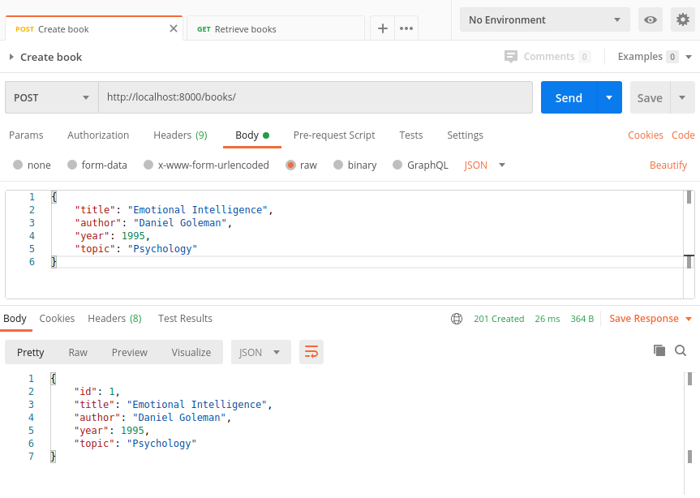
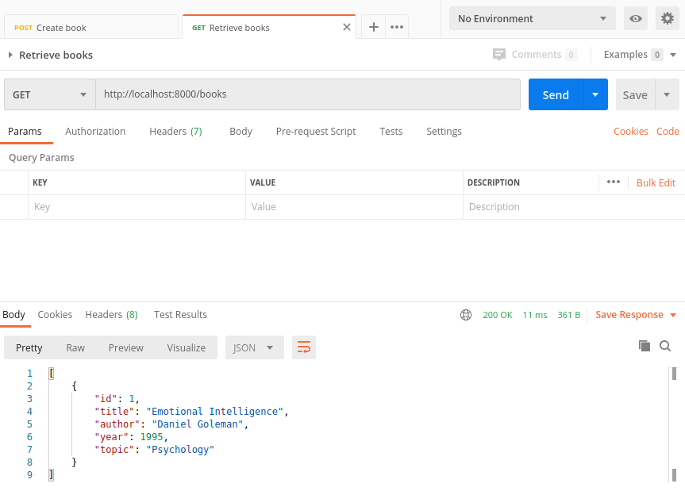

BOOKS REST API
--------------------------------------------------------------------

Sencilla API Rest desarrollada con Django Rest Framework que 
se levanta dentro de contenedor Docker.

--------------------------------------------------------------------

Se genera archivo Dockerfile que permite generar imagen
para levantar aplicacion Django dentro de contenedor Docker:

```

  FROM python:3.6

  WORKDIR /usr/src/app

  COPY requirements.txt .
  RUN pip install -r requirements.txt

  RUN mkdir books_app
  RUN mkdir django_app_in_docker

  COPY books_app ./books_app
  COPY django_app_in_docker ./django_app_in_docker
  COPY manage.py .

  COPY entrypoint.sh .
  RUN chmod +x ./entrypoint.sh

  EXPOSE 8888
  CMD ["./entrypoint.sh"]

```

--------------------------------------------------------------------

El archivo entrypoint.sh se gatilla al momento de levantar 
el contenedor Docker permitiendo la ejecucion de migraciones
y la ejecucion de la aplicacion Django utilizando runserver:

```

  #!/bin/sh
  python manage.py makemigrations
  python manage.py migrate
  python manage.py runserver 0.0.0.0:8888

```

--------------------------------------------------------------------

Se construye imagen a partir de archivo Dockerfile y se levanta 
contenedor a partir de la imagen generada:

```

  docker build -t django-rest-books .

  docker run -d -p8000:8888 django-rest-books

```

--------------------------------------------------------------------

**Ejecucion de endpoint que agrega libros por medio de Postman:**




--------------------------------------------------------------------


**Ejecucion de endpoint que recupera libros por medio de Postman:**




--------------------------------------------------------------------